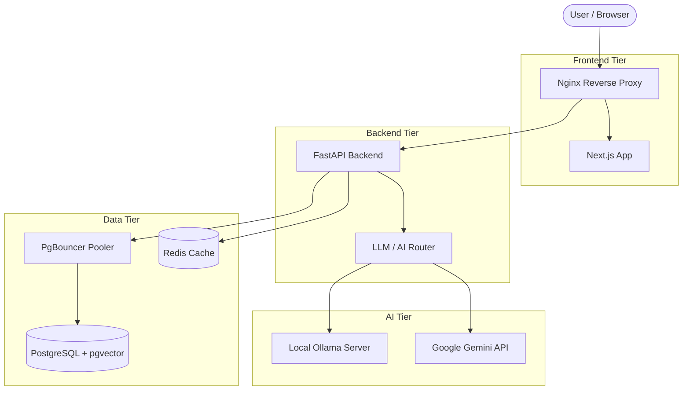

# Architecture & Design 🏗️

This document outlines the high-level architecture, design decisions, and core strengths of the **LinguaFlow AI** project.

## 🌟 Core Strengths

1. **Hybrid AI Architecture**: Seamlessly switch between local, cost-free inference (Ollama with NVIDIA CUDA acceleration) and powerful cloud models (Google Gemini). This provides unmatched flexibility for development, privacy, and production scaling.
2. **Robust Vector RAG**: Native integration of PostgreSQL with `pgvector` ensures enterprise-grade vector storage, while maintaining a lightweight JSON fallback for simple setups.
3. **Developer Experience (DX)**: Custom PowerShell scripts (`dev-fast.ps1`) orchestrate a hybrid development environment. Databases run reliably in Docker, while the backend and frontend run natively on the host OS for sub-second hot-reloading.
4. **Resilient Data Layer**: PgBouncer sits in front of PostgreSQL to manage connection pooling, preventing database exhaustion during high-concurrency API requests.
5. **Observability Built-in**: Integrated Prometheus metrics for tracking LLM token usage, system latency, and API health.

---

## 🏛️ System Architecture

The application follows a modern decoupled architecture:

### 1. Frontend Tier (Next.js)
- **Framework**: Next.js 14 utilizing React Server Components where appropriate.
- **Styling**: TailwindCSS for utility-first, responsive design.
- **State Management**: React hooks and context.
- **Voice Capabilities**: Leverages browser-native `SpeechRecognition` and `SpeechSynthesis` APIs to provide voice chat without incurring third-party API costs.

### 2. Backend Tier (FastAPI)
- **Framework**: FastAPI for high-performance, asynchronous Python endpoints.
- **Routing**: Modular routers separating Chat, Admin, Auth, and Config.
- **AI Router (`services/ai_providers`)**: An abstract factory pattern that routes prompts to the active AI provider (Ollama, Gemini, or Mock) seamlessly based on `.env` configuration or Admin UI settings.
- **RAG Engine (`services/rag`)**: 
  - Chunks document text.
  - Generates embeddings using the active embedding provider.
  - Stores vectors in PostgreSQL.
  - Retrieves relevant context using cosine similarity searches to augment the LLM prompts.

### 3. Data Tier (PostgreSQL + Redis)
- **PostgreSQL**: The source of truth for user data, admin settings, chat history, and document embeddings.
- **pgvector**: An extension for PostgreSQL that enables native vector similarity searches right alongside relational queries.
- **PgBouncer**: Crucial for FastAPI applications. FastAPI's async nature can rapidly open many database connections; PgBouncer pools these connections to keep Postgres stable.
- **Redis**: Used for high-speed caching and rate-limiting.

### 4. Infrastructure & Observability (Docker)
- **Containerization**: Everything is containerized using Docker Compose for production deployments.
- **Nginx**: Acts as the API Gateway, routing `/api/v1/*` traffic to the backend and `/` traffic to the Next.js frontend.
- **Prometheus**: Scrapes `/api/v1/metrics` from FastAPI to visualize application health.

---

## 🔄 Data Flows

### Chat Flow (Text/Voice)
1. User sends a message via the Next.js UI.
2. The message hits the FastAPI `/chat` endpoint.
3. The backend stores the user message in PostgreSQL.
4. The backend queries the RAG system to see if the user's prompt matches any uploaded document vectors.
5. Relevant context is injected into the prompt.
6. The compiled prompt is sent to the configured LLM (e.g., Ollama `llama3.2`).
7. The LLM streams the response back to FastAPI.
8. FastAPI saves the AI's response to PostgreSQL and returns it to the UI.
9. (Optional) The UI uses `SpeechSynthesis` to read the answer aloud.

### Document Upload (RAG) Flow
1. Admin uploads a PDF/TXT document via the Admin UI.
2. FastAPI extracts the raw text.
3. The text is split into overlapping chunks to preserve context.
4. Each chunk is sent to the embedding model (e.g., `nomic-embed-text`) to generate a vector representation.
5. Vectors are inserted into the PostgreSQL database using `pgvector`.
